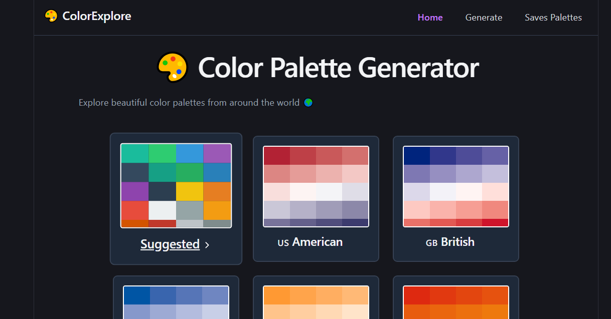
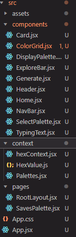
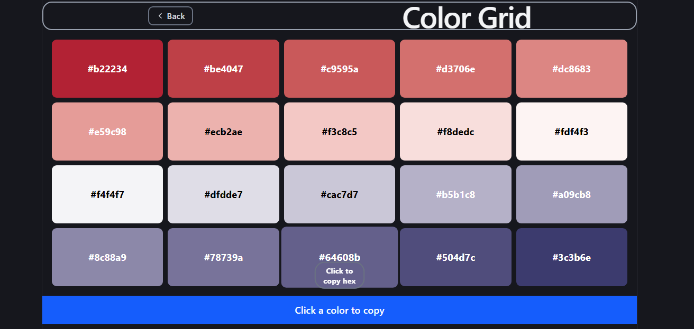
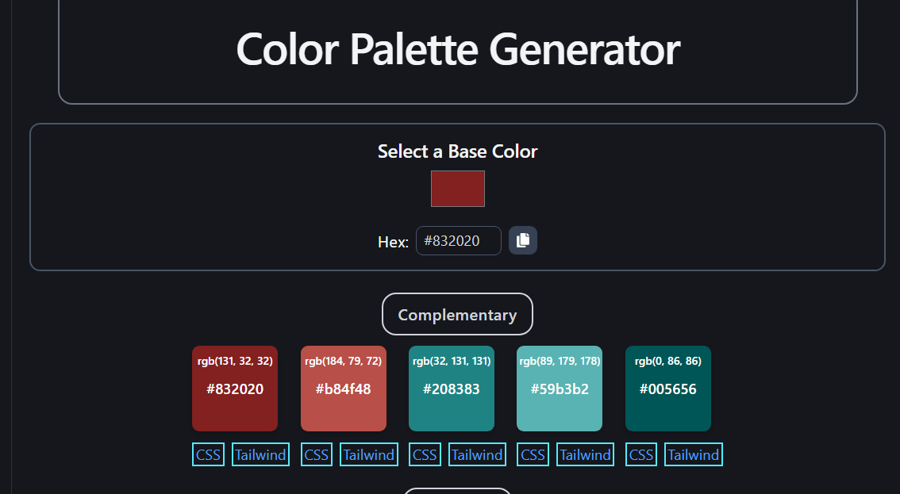

# 🎨 Color Palette Generator

A modern React-based Color Palette Generator inspired by Flat UI Colors. This application allows users to explore, create, and save custom color palettes while copying color codes in multiple formats.

---



## 🚀 Features

* 🎨 Generate and explore beautiful color palettes
* 🌍 Predefined themed palettes (e.g., country-based)
* ✨ Create your own custom palettes
* 📋 Copy color codes in:

  * HEX
  * RGB
  * RGBA
* 💾 Save palettes using localStorage
* 🔄 Persistent data (no loss on refresh)
* ⚡ Smooth UI interactions and hover effects
* 📱 Fully responsive design

---

## 🛠️ Tech Stack

* React.js
* Tailwind CSS
* chroma.js
* React Router
* Context API
* localStorage

---

## 📂 Project Structure





---

## ⚙️ Installation & Setup

1. Clone the repository:

```
git clone https://github.com/your-username/color-palette-generator.git
```

2. Navigate to the project folder:

```
cd color-palette-generator
```

3. Install dependencies:

```
npm install
```

4. Start the development server:

```
npm run dev
```

---

## 📸 Screenshots

### 🎨 Palette View


### Generate Palette


---

## 🧠 Future Improvements

* 🔍 Search palettes
*  💾 Saved palttes
* 🎯 Drag & drop color reordering(the user-defined palettes only)
* 🎨 Custom color picker
* ☁️ Backend integration (save palettes to database)
* 🔐 User authentication

---

## 🤝 Contributing

Contributions are welcome! Feel free to fork the repo and submit a pull request.

---

## 📄 License

This project is open-source and available under the MIT License.


---

## 🙌 Acknowledgement

Inspired by Flat UI Colors.

---

## 👨‍💻 Author

Hitesh Mehra

---

⭐ If you like this project, consider giving it a star on GitHub!
